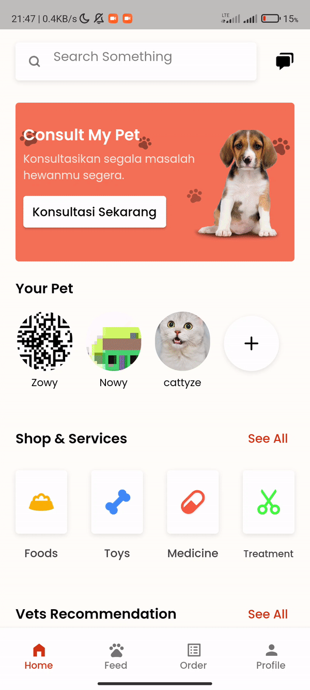

<h1 align="center">
  PETSCAPE
</h1>
<p align="center">
  take care your pet with petscape
</p>
<p align="center">
  <a href="https://flutter.dev/"></a>
  <a href="https://github.com/codeyzx/gliders/"></a>
</p>

<p align="center">
  
</p>

## Table of Contents
- [Introduction](#introduction)
- [Installation](#installation)
- [Demo](#demo)
- [Features](#features)
- [Dependencies](#dependencies)


## Introduction

Petscape is an all-in-one application or platform for your pet's needs, we realize that as a pet owner in Indonesia it is pretty difficult starting from the difficulty of accessing and buying your various animal needs, the problem of finding clear veterinary information, and making an appointment. or consulting, difficult to track your animal's medical record and no place to share your moments with your animal, and others. Therefore, Petscape is here to solve this problem.

## Installation

Clone or Download and Open it into Android Studio, VSCode, or Other IDE / Text Editor
```
https://github.com/codeyzx/petscape.git
```  

## Demo

|Shop|
|--|
|
|Pets|Vets|
|--|--|
|||
|Feed|Chat|
|--|--|
|||

## Features
- Shop
- Vets
- Feed
- Pets
- Chat

## Dependencies
- [Firebase Auth](https://pub.dev/packages/cloud_firestore)
- [Dio](https://pub.dev/packages/dio)
- [File Picker](https://pub.dev/packages/file_picker)
- [Firebase Auth](https://pub.dev/packages/firebase_auth)
- [Firebase Storage](https://pub.dev/packages/firebase_storage)
- [Flutter Riverpod](https://pub.dev/packages/flutter_riverpod)
- [Flutter Screenutil](https://pub.dev/packages/flutter_screenutil)
- [Flutter Chat Ui](https://pub.dev/packages/flutter_chat_ui)
- [Flutter Chat Types](https://pub.dev/packages/flutter_chat_types)
- [Go Router](https://pub.dev/packages/go_router)
- [Google Fonts](https://pub.dev/packages/google_fonts)
- [Google Sign In](https://pub.dev/packages/google_sign_in)
- [Image](https://pub.dev/packages/image)
- [Image Picker](https://pub.dev/packages/image_picker)
- [Intl](https://pub.dev/packages/intl)
- [Midtrans Sdk](https://pub.dev/packages/midtrans_sdk)
- [Open Filex](https://pub.dev/packages/open_filex)
- [Path Provider](https://pub.dev/packages/path_provider)
- [Percent Indicator](https://pub.dev/packages/percent_indicator)
- [Permission Handler](https://pub.dev/packages/permission_handler)
- [Shared Preferences](https://pub.dev/packages/shared_preferences)
- [Shimmer](https://pub.dev/packages/shimmer)
- [Smooth Page Indicator](https://pub.dev/packages/smooth_page_indicator)
- [Uuid](https://pub.dev/packages/uuid)